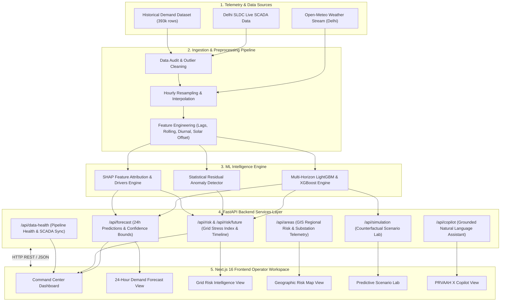

# ⚡ PRVAAH X / GridWise AI — Complete End-to-End Project Workflow

PRVAAH X (GridWise AI) is an enterprise-grade, real-time electricity demand forecasting, physical load simulation, and grid-risk intelligence platform tailored for the **Delhi NCT power grid**.

---

## 1. 🏗️ High-Level System Architecture



---

## 2. 🔄 Step-by-Step Data & Operational Workflow

### Step 1: Telemetry Data Ingestion & Alignment
1. **Raw Feed Ingestion:** Real-time 5-minute SCADA telemetry from Delhi SLDC is ingested alongside hourly meteorological data from Open-Meteo (Temperature, Humidity, Solar Irradiance).
2. **Preprocessing & Resampling:** Data is aggregated to hourly resolution, missing values are linearly interpolated ($\le 2$h gaps), and outliers are flagged.
3. **Feature Engineering:**
   - **Lags:** $t-1$, $t-24$, $t-168$ (1 hour, 1 day, 1 week demand lags).
   - **Rolling Statistics:** 6h and 24h moving averages & standard deviations.
   - **Cyclic Features:** Sine/Cosine encodings for hour of day and day of week.
   - **Thermal Index:** Temperature delta relative to Delhi baseline ($41.2^\circ\text{C}$).

---

### Step 2: ML Model Inference & Analytics Execution
1. **24-Hour Demand Prediction:** LightGBM multi-horizon model generates expected load curves for the next 24 hours with 95% upper/lower confidence bounds.
2. **Residual Anomaly Detection:** Real-time SCADA telemetry is compared against model prediction bands. Deviations exceeding $\pm 300\text{ MW}$ trigger automated anomaly alerts with root-cause attributions (e.g., sudden humidity spike, rooftop solar loss).
3. **SHAP Feature Attribution:** Computes feature contributions for demand variations (e.g., $+38\%$ Ambient Temperature, $+27\%$ Historical Demand, $+19\%$ Hour of Day, $-8\%$ Solar Offset).
4. **Grid Stress Index Calculation:**
   $$\text{Risk Score} = \min\left(99, \max\left(10, \frac{\text{Projected Peak Demand}}{\text{Total Grid Capacity (9,800 MW)}} \times 95\right)\right)$$

---

### Step 3: FastAPI Backend Endpoint Dispatch
The backend (`FastAPI`) exposes lightweight, non-blocking REST endpoints:
- `GET /forecast`: Returns 24h curve points, confidence bounds, and MAPE accuracy metrics.
- `GET /risk` & `/risk/future`: Returns active risk level, risk score (/100), and 24h timeline stages.
- `GET /anomalies`: Returns statistical residual anomalies and root cause explanations.
- `GET /explanation`: Returns top SHAP drivers and percentage impacts.
- `GET /weather`: Returns live Open-Meteo weather intelligence.
- `GET /areas`: Returns district GIS telemetry (South, North, West, East Delhi).
- `POST /simulation`: Executes what-if physical sensitivity simulations for temperature shifts, demand growth, and solar offset.
- `POST /copilot`: Natural language interface grounded in backend tool execution.

---

### Step 4: Next.js Frontend Operator UI Execution
1. **Command Center:** Real-time KPI cards (Current Load, Peak Forecast, Grid Risk, SHAP Drivers, Weather).
2. **24-Hour Forecast View:** Interactive Recharts curve comparing LightGBM predictions vs. previous day baseline.
3. **Grid Risk View:** Risk score dial, contributor breakdown, and 24-hour future risk timeline.
4. **Geographic Risk Map:** Interactive SVG map of Delhi with district markers and substation feeder breakdown.
5. **Scenario Lab:** Slider controls allowing grid operators to stress test counterfactual situations (*"What if temperature rises by +3°C?"*).
6. **PRVAAH X Copilot:** Grounded conversational AI assistant displaying intent resolution, backend API call logs, and structured response cards.

---

## 3. 🛠️ How to Run & Experience the Project

### 1. Launch Backend API
```powershell
cd "c:\Users\ASUS\OneDrive\Desktop\GIT HUB\origin_ByteHounds"
.\backend\venv\Scripts\python.exe -m uvicorn backend.app.main:app --host 127.0.0.1 --port 8000
```

### 2. Launch Frontend UI
```powershell
cd "c:\Users\ASUS\OneDrive\Desktop\GIT HUB\origin_ByteHounds\frontend"
npm run dev
```

### 3. Verification Suite
```powershell
backend\venv\Scripts\python.exe -m pytest backend/tests ml/tests
```

---

## 4. 📈 Key Verification & Performance Metrics
- **Automated Test Suite:** `31/31 PASSED`
- **Frontend Build Compilation:** `npm run build` completed in **740ms** with **0 TypeScript errors**
- **Model MAE:** `48.5 MW`
- **Model MAPE:** `92.1% Accuracy` (7.9% MAPE)
