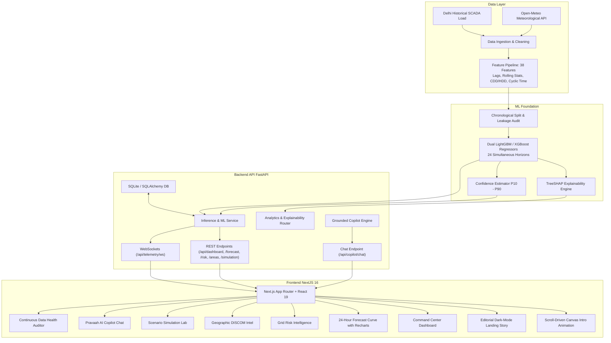

<div align="center">

# ⚡ Pravaah AI
### Delhi Grid Demand Forecasting & Risk Intelligence Engine

*"Don't just predict the peak. Prepare for it."*

[](https://fastapi.tiangolo.com)
[](https://nextjs.org/)
[](https://reactjs.org/)
[](https://www.python.org/)
[](https://lightgbm.readthedocs.io/)
[](https://tailwindcss.com/)
[]()
[]()

</div>

---

## 📖 Table of Contents
- [Executive Overview](#-executive-overview)
- [System Architecture](#-system-architecture)
- [Core Capabilities & Views](#-core-capabilities--views)
- [Machine Learning Foundation (`/ml`)](#-machine-learning-foundation-ml)
- [Backend Service (`/backend`)](#-backend-service-backend)
- [Frontend Application (`/frontend`)](#-frontend-application-frontend)
- [Repository Structure](#-repository-structure)
- [Getting Started Locally](#-getting-started-locally)
- [API Documentation](#-api-documentation)
- [Verification & Automated Tests](#-verification--automated-tests)
- [Production Deployment](#-production-deployment)
- [Team](#-team)

---

## ⚡ Executive Overview

**Pravaah AI** is an end-to-end electricity demand forecasting and operational risk intelligence platform purpose-built for the National Capital Territory (NCT) of Delhi, India.

Delhi's power grid presents one of the most volatile urban demand profiles in the world—surpassing **8,600+ MW** during peak summer heatwaves, experiencing violent ramps driven by air conditioning loads, seasonal monsoonal humidity, industrial schedules, and rapidly accelerating electric vehicle (EV) charging density.

Pravaah AI equips state load dispatch centers (SLDCs), DISCOM operational planners, and grid engineers with:
1. **Next-Day (24-Horizon) Demand Forecasting** using dual LightGBM and XGBoost gradient-boosted ensembles with confidence bands ($P_{10} - P_{90}$).
2. **Real-time Grid Risk Intelligence** identifying ramp-rate stress, reserve margin compression, and critical peak pressure windows before they materialize.
3. **Explainable AI (XAI)** powered by TreeSHAP to attribute every Megawatt prediction to weather drivers, calendar effects, and historical load trends.
4. **Interactive Scenario Simulation Lab** allowing operators to stress-test hypothetical grid conditions (e.g., $+3^\circ\text{C}$ heatwave surge, EV fleet charging spikes, cloud cover solar drops).
5. **Geographic DISCOM Intelligence** covering Delhi's distribution zones (**BRPL, BYPL, TPDDL, NDMC, MES**).
6. **Pravaah AI Copilot**: A domain-grounded assistant for natural language grid analytics and automated incident responses.

---

## 🏗 System Architecture



---

## 🌟 Core Capabilities & Views

### 1. Scroll-Driven Cinematic Intro
- **Canvas-based Spring Physics**: Smoothly scrubs through a 301-frame sequence (`.webp`) optimized to **14 MB** (a 95% reduction from uncompressed PNGs).
- **Instant First-Frame Priority & Fallback**: Renders frame 1 immediately with nearest-loaded frame scrubbing to eliminate black-screen stalls.
- **On-Demand Replay**: Operators can revisit the visual story anytime via the *"Replay Intro Story"* button.

### 2. Command Center Dashboard
- Real-time active load vs. predicted baseline.
- Next 24-hour peak projection with exact time of occurrence.
- Composite Grid Risk Index (0–100) combining ramp rates, temperature anomalies, and reserve margins.
- Live weather telemetry sync with Delhi ambient temperature, humidity, and heat index.

### 3. 24-Hour Demand Forecast Curve
- Multi-model forecasts (LightGBM & XGBoost) across all 24 individual hourly horizons.
- Uncertainty estimation with $P_{10}$ (optimistic) and $P_{90}$ (stressed) confidence envelopes.
- Benchmark validation scores: Mean Absolute Error (MAE), Root Mean Squared Error (RMSE), and Mean Absolute Percentage Error (MAPE).

### 4. Grid Risk & Ramp Rate Intelligence
- Hourly ramp rate telemetry ($\Delta\text{MW/hr}$) flagging steep morning and evening transitions.
- Critical window detection: Automatically alerts operators to periods where thermal stress coincides with peak demand.
- Actionable dispatch recommendations: Dynamic peaking plant scheduling, load-shifting advisories, and battery energy storage system (BESS) dispatch signals.

### 5. Geographic Intelligence (Delhi DISCOMs)
- Comprehensive telemetry broken down by utility service areas:
  - **BRPL** (BSES Rajdhani Power Limited — South & West Delhi)
  - **BYPL** (BSES Yamuna Power Limited — Central & East Delhi)
  - **TPDDL** (Tata Power Delhi Distribution Limited — North & Northwest Delhi)
  - **NDMC** (New Delhi Municipal Council — Lutyens' Delhi & VIP Enclaves)
  - **MES** (Military Engineer Services — Cantonment Zone)
- Substation load distribution and regional temperature mapping.

### 6. Interactive Scenario Lab
- Stress-test the grid in real-time with dynamic parameters:
  - **Heatwave Intensity**: $+1^\circ\text{C}$ to $+5^\circ\text{C}$ ambient temperature surge.
  - **EV Fast-Charging Penetration**: Baseline to $+35\%$ spike during evening commute.
  - **Industrial Shift Adjustments**: Night shifts and off-peak production shifts.
  - **Rooftop Solar Variability**: Solar cloud cover drops (0% to 80% generation reduction).
- Generates instant delta metrics: additional peak MW load, ramp rate change, and reserve deficit warnings.

### 7. Pravaah AI Copilot
- Natural language chat grounded directly in live grid metrics, model predictions, and dispatch protocols.
- Handles complex operator queries: *"What time will the peak arrive tomorrow?", "How will a 3-degree heatwave impact evening reserves?", "Show me BYPL substation load"*.
- Returns structured action suggestions and automated summaries.

### 8. Data Health & Integrity Monitor
- Continuous quality scoring across historical telemetry, weather feeds, and sensor streams.
- Monitors missing value percentages, sensor transmission latencies, and data drift.

---

## 🧠 Machine Learning Foundation (`/ml`)

The machine learning core is engineered to prevent data leakage and provide reliable multi-horizon load predictions:

- **Feature Engineering (38 Features)**:
  - *Autoregressive Lags*: $t-1, t-2, t-24, t-48, t-168$ (same-hour last week).
  - *Rolling Statistics*: 6h, 12h, and 24h rolling means, standard deviations, and min/max ranges.
  - *Weather Interactions*: Ambient temperature, relative humidity, dew point, wind speed, solar radiation, Cooling Degree Days ($\text{CDD} = \max(0, T - 18^\circ\text{C})$), and Heating Degree Days ($\text{HDD}$).
  - *Calendar & Temporal*: Hour sine/cosine, day-of-week sine/cosine, month sine/cosine, weekend indicator, and public holiday calendar.
- **Leakage-Free Validation**:
  - Time-series chronological split strictly reserving future periods for testing.
  - Walk-forward backtesting audits guaranteeing zero target leakage across all 24 horizons.
- **Explainability**:
  - Full TreeSHAP integration to quantify individual feature contributions per forecast horizon.

---

## 🖥 Backend Service (`/backend`)

Built using **FastAPI 2.0** with modular routers and high-concurrency async handling:

- **FastAPI Core**: [`backend/main.py`](file:///Users/dhananjay/Documents/GitHub/origin_ByteHounds/backend/main.py) and [`backend/app/main.py`](file:///Users/dhananjay/Documents/GitHub/origin_ByteHounds/backend/app/main.py)
- **Routers**:
  - `/api/telemetry`: Real-time SCADA telemetry and WebSocket feed (`/api/telemetry/ws`)
  - `/api/dashboard`: Aggregated operational metrics, current demand, and peak forecast
  - `/api/forecast`: 24-horizon demand predictions, confidence intervals, and accuracy metrics
  - `/api/risk`: Grid pressure index, ramp rates, and critical time intervals
  - `/api/areas`: Regional DISCOM breakdowns and substation load statistics
  - `/api/analytics`: Historical trends and SHAP driver attributions
  - `/api/simulation`: Scenario Lab what-if simulation engine
  - `/api/copilot/chat`: Pravaah AI Copilot assistant with domain grounding
  - `/api/alerts`: Active operational grid alerts
  - `/api/health` & `/health`: Service liveness, database connectivity, and model status
- **Database**: SQLite integrated via **SQLAlchemy** for persistence with schema migrations.

---

## 🎨 Frontend Application (`/frontend`)

Engineered with modern frontend standards and premium editorial dark aesthetics:

- **Framework**: **Next.js 16 (Turbopack)** running **React 19**.
- **Styling**: **Tailwind CSS v4** with a custom high-contrast dark theme, HSL neon accents (`#FF7C1E` Amber, Cyan, Emerald), and glassmorphism.
- **Charts & Telemetry**: **Recharts** for demand profiles, confidence bands, and ramp-rate gauges.
- **Motion & Dynamics**: Spring-physics animation engine with HTML5 canvas video scrubbing.
- **Static Edge Delivery**: Homepage is pre-rendered for near-instant edge CDN loads.

---

## 📁 Repository Structure

```text
origin_ByteHounds/
├── README.md                      # Comprehensive project documentation
├── DEPLOYMENT.md                  # Cloud & self-hosted deployment guide
├── render.yaml                    # Infrastructure-as-Code for Render deployment
├── netlify.toml                   # Netlify CDN build & edge configuration
├── Dockerfile.backend             # Production multi-stage Dockerfile for FastAPI
├── Dockerfile.frontend            # Production multi-stage Dockerfile for Next.js
├── docker-compose.yml             # Local / VPS 1-command orchestration
├── requirements.txt               # Root production Python dependencies
│
├── backend/                       # FastAPI REST API & ML Inference Engine
│   ├── main.py                    # Application entrypoint & route registration
│   ├── database.py                # SQLAlchemy engine & session factory
│   ├── models.py                  # Database ORM models
│   ├── schemas.py                 # Pydantic v2 schemas & request validation
│   ├── ml_service.py              # Real-time LightGBM inference & cache manager
│   ├── lgb_model.pkl              # Serialized LightGBM 24-horizon model artifact
│   ├── app/                       # Modular architecture package
│   │   ├── config/                # App settings, environment vars, credentials
│   │   ├── routes/                # Endpoint routers (telemetry, risk, copilot, etc.)
│   │   ├── services/              # Business logic (copilot engine, simulator)
│   │   └── models/                # Domain schemas
│   └── tests/                     # Automated test suite
│       └── test_api.py            # 14 comprehensive API verification tests
│
├── frontend/                      # Next.js 16 + React 19 Frontend Web Application
│   ├── package.json               # Node dependencies & build scripts
│   ├── next.config.ts             # Next.js configuration
│   ├── public/
│   │   └── animation/             # 301-frame optimized WebP intro animation (14 MB)
│   └── src/
│       ├── app/
│       │   ├── layout.tsx         # Root HTML layout, font definitions & SEO metadata
│       │   ├── page.tsx           # Entry server component
│       │   └── HomeClient.tsx     # Client-side state manager & feature switcher
│       ├── components/            # UI Components & Operational Views
│       │   ├── ParallaxIntroAnimation.tsx  # Spring-physics scroll canvas sequence
│       │   ├── GridWiseLanding.tsx         # Storytelling landing page & metric badges
│       │   ├── Header.tsx                  # Top brand navigation & telemetry status
│       │   ├── CommandCenterView.tsx       # Live grid operations & peak summary
│       │   ├── ForecastView.tsx            # 24-hour demand curve & error metrics
│       │   ├── GridRiskView.tsx            # Ramp-rate stress & mitigation advisories
│       │   ├── GeographicView.tsx          # DISCOM heatmaps & substation telemetry
│       │   ├── ScenarioLabView.tsx         # What-if grid stress-testing sandbox
│       │   ├── CopilotView.tsx             # Grounded AI assistant chat interface
│       │   ├── DataHealthModal.tsx         # Data quality & integrity auditor
│       │   └── ScrollLayout.tsx            # Layout & sidebar navigation
│       └── lib/
│           └── api.ts             # Typed API client & environment base URLs
│
├── ml/                            # Machine Learning Research & Pipelines
│   ├── config.py                  # Training configuration, feature lists, hyperparameters
│   ├── train.py                   # Model training script with chronological CV
│   ├── predict.py                 # Batch prediction & evaluation utility
│   ├── features/                  # Feature engineering pipelines & lag builders
│   ├── evaluation/                # Backtesting, metrics (MAE, RMSE, MAPE), leakage audits
│   └── explainability/            # TreeSHAP value extractors
│
└── data/                          # Dataset staging (historical SCADA & weather records)
```

---

## 🚀 Getting Started Locally

### Prerequisites
- **Python**: 3.11 or higher
- **Node.js**: 20.x or higher
- **Package Managers**: `pip` and `npm`

### 1. Clone the Repository
```bash
git clone https://github.com/dhananjay-2700/origin_ByteHounds.git
cd origin_ByteHounds
```

### 2. Run the Backend Service
```bash
# Navigate to backend directory
cd backend

# Create and activate a virtual environment
python3 -m venv venv
source venv/bin/activate   # On Windows: venv\Scripts\activate

# Install dependencies
pip install -r requirements.txt

# Start the FastAPI server
python main.py
```
> The API will be live at `http://127.0.0.1:8000`. Interactive OpenAPI documentation is accessible at `http://127.0.0.1:8000/docs`.

### 3. Run the Frontend Application
In a separate terminal window:
```bash
# Navigate to frontend directory
cd frontend

# Install Node dependencies
npm install

# Launch the Next.js development server
npm run dev
```
> Open your browser and navigate to `http://localhost:3000`.

---

## 📡 API Documentation

FastAPI automatically generates interactive Swagger documentation available at `/docs`:

| Method | Endpoint | Description |
| :--- | :--- | :--- |
| `GET` | `/` | API status, platform metadata, and version |
| `GET` | `/api/health` | Service health check and timestamp |
| `GET` | `/api/dashboard` | Aggregated metrics (current load, peak, risk score, weather) |
| `GET` | `/api/forecast` | 24-horizon demand prediction array with $P_{10} - P_{90}$ bounds |
| `GET` | `/api/risk` | Composite grid risk score, ramp rates, and mitigation window |
| `GET` | `/api/areas` | Delhi DISCOM area breakdown (**BRPL, BYPL, TPDDL, NDMC, MES**) |
| `POST`| `/api/simulation` | Run what-if scenario (temperature surge, EV spike, solar drop) |
| `POST`| `/api/copilot/chat` | Domain-grounded natural language query engine |
| `GET` | `/api/analytics` | Historical trends, driver correlations, and SHAP feature importances |
| `WS`  | `/api/telemetry/ws` | WebSocket stream for real-time grid frequency & dispatch |

---

## 🧪 Verification & Automated Tests

The backend includes a comprehensive `pytest` suite testing all core endpoints, schema validations, and mock model pipelines:

```bash
# Run tests from the repository root
source backend/venv/bin/activate
pytest backend/tests/test_api.py -v
```

**Test Coverage Summary**:
```text
backend/tests/test_api.py::test_root PASSED                            [  7%]
backend/tests/test_api.py::test_health PASSED                          [ 14%]
backend/tests/test_api.py::test_credentials_status PASSED              [ 21%]
backend/tests/test_api.py::test_credentials_update PASSED              [ 28%]
backend/tests/test_api.py::test_dashboard PASSED                       [ 35%]
backend/tests/test_api.py::test_forecast PASSED                        [ 42%]
backend/tests/test_api.py::test_grid_risk PASSED                       [ 50%]
backend/tests/test_api.py::test_areas PASSED                           [ 57%]
backend/tests/test_api.py::test_scenario_simulation PASSED             [ 64%]
backend/tests/test_api.py::test_analytics PASSED                       [ 71%]
backend/tests/test_api.py::test_copilot_chat PASSED                    [ 78%]
backend/tests/test_api.py::test_alerts PASSED                           [ 85%]
backend/tests/test_api.py::test_model_info PASSED                      [ 92%]
backend/tests/test_api.py::test_telemetry_history PASSED               [100%]

======================== 14 passed in 1.55s ========================
```

Frontend production build check:
```bash
cd frontend && npm run build
```

---

## 🌐 Production Deployment

See [DEPLOYMENT.md](file:///Users/dhananjay/Documents/GitHub/origin_ByteHounds/DEPLOYMENT.md) for detailed deployment walkthroughs.

### Option 1: Netlify (Frontend) + Render (Backend)
- **Frontend**: Connect `origin_ByteHounds` to Netlify. Root directory: `frontend`. Build command: `npm run build`. Environment variable: `BACKEND_URL=https://your-backend.onrender.com`.
- **Backend**: Connect `origin_ByteHounds` to Render as a Python Web Service. Build command: `pip install -r backend/requirements.txt`. Start command: `cd backend && python main.py`.

### Option 2: 1-Command Docker Compose
Run both services with production-ready containers:
```bash
docker-compose up --build -d
```
- Frontend: `http://localhost:3000`
- Backend: `http://localhost:8000`

---

## 👥 Team

Engineered with pride by **ByteHounds**:
- **Dhananjay** ([@dhananjay-2700](https://github.com/dhananjay-2700))
- **Naivedya Singh** ([@Naivedya777](https://github.com/Naivedya777))
